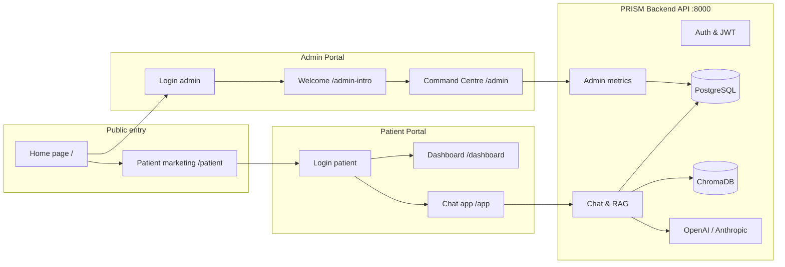
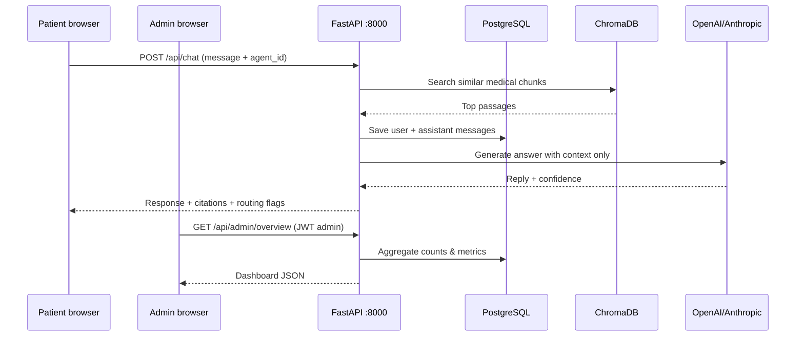

# PRISM Platform — Complete Patient & Admin Portal Guide (Sprint 3.5)

**Audience:** Clinical operators, product owners, and non-technical stakeholders  
**Language:** Plain English (layperson-friendly)  
**Version:** PRISM 2.0 · Black & Pink One · Sprint 3.5

---

## Table of Contents

1. [What Is PRISM?](#1-what-is-prism)
2. [How the Two Portals Fit Together](#2-how-the-two-portals-fit-together)
3. [Technology Stack (Tools Behind the Scenes)](#3-technology-stack-tools-behind-the-scenes)
4. [Getting In — URLs, Accounts & Security](#4-getting-in--urls-accounts--security)
5. [Patient Portal — Full Feature Guide](#5-patient-portal--full-feature-guide)
6. [Admin Portal (Command Centre) — Full Feature Guide](#6-admin-portal-command-centre--full-feature-guide)
7. [How Data Flows (Simple Architecture)](#7-how-data-flows-simple-architecture)
8. [API Reference Summary](#8-api-reference-summary)
9. [Operational Tips & Known Limits](#9-operational-tips--known-limits)

---

## 1. What Is PRISM?

**PRISM** stands for **Patient-centric Retrieval Intelligence System for Medicine**.

In simple terms, PRISM is a **healthcare AI platform** with two faces:

| Portal | Who uses it | Purpose in one sentence |
|--------|-------------|-------------------------|
| **Patient Portal** | People seeking health guidance | Chat with specialist AI “companions” that answer using **verified medical documents**, not guesses. |
| **Admin Portal (Command Centre)** | Medical directors, operators, admins | Watch system health, measure AI quality, manage documents, and see when patients need human help. |

### The core idea: RAG (why answers are safer)

Most chatbots “make things up” when they do not know an answer. That is dangerous in medicine.

PRISM uses **RAG (Retrieval-Augmented Generation)**:

1. You ask a question.
2. The system **searches its medical library** (PubMed, CDC, uploaded guidelines, etc.).
3. It gives those facts to the AI and says: *“Answer only from these paragraphs.”*
4. You get a reply with **sources (citations)** where possible.

Think of it as an **open-book exam** for the AI, not a memory test.

### Clinical structure: 5 diseases × 30 agents

| Disease domain | Code | What it covers (plain language) |
|----------------|------|----------------------------------|
| Cancer Care | CA | Screening, treatment paths, support, survivorship, genetics |
| Diabetes | DM | Glucose, insulin, nutrition, complications, pregnancy/special cases |
| Cardiovascular | CV | Heart risk, emergencies, meds, rehab, diet |
| Mental Illness | MH | Depression, anxiety, sleep, trauma, crisis support |
| Respiratory | RS | Asthma, COPD, rehab, medications, sleep apnea |

Each domain has **6 AI agents** (30 total) — like a small team of virtual specialists, each focused on one slice of care (e.g. “Diabetes Nutrition Specialist” vs “Insulin Management Specialist”).

---

## 2. How the Two Portals Fit Together



**Patient journey (typical):**  
Home → Patient landing → Sign in → Dashboard (subscriptions overview) → **Chat app** (main experience).

**Admin journey (typical):**  
Home → Admin login → **Admin intro** (capabilities overview) → **Command Centre** (17 sidebar modules).

---

## 3. Technology Stack (Tools Behind the Scenes)

### 3.1 Frontend (what you see in the browser)

| Tool | Role | Layman explanation |
|------|------|-------------------|
| **React 18** | UI framework | Building blocks for screens, buttons, chat bubbles |
| **Vite 5** | Build & dev server | Fast local website; proxies API calls to backend |
| **React Router 6** | Page navigation | Moves you between `/app`, `/admin`, `/login`, etc. |
| **Tailwind CSS 3** | Styling | Consistent colors, spacing, dark themes |
| **Zustand 5** | App state | Remembers who is logged in (token in browser storage) |
| **Axios** | HTTP client | Sends messages and loads admin charts from the API |
| **Recharts 2** | Charts | Line/bar/pie graphs in admin dashboards |
| **Lucide React** | Icons | Sidebar and button icons |
| **React Markdown** | Rich text | Formats AI answers with lists and tables |
| **React Dropzone** | File upload | Drag-and-drop medical PDFs in admin |
| **React Hot Toast** | Notifications | “Success” / “Error” popups |
| **Radix UI** | Accessible widgets | Dialogs, tabs, tooltips |
| **date-fns** | Dates | “Last 7 days” style labels |

**Two frontend run modes:**

| Mode | Command | URL | Storage key |
|------|---------|-----|-------------|
| Patient | `npm run dev` | http://localhost:5177 | `prism-auth` |
| Admin | `npm run admin` | http://localhost:5178 | `prism-auth-admin` |

### 3.2 Backend (the “engine room”)

| Tool | Role | Layman explanation |
|------|------|-------------------|
| **Python 3.11+** | Language | All server logic |
| **FastAPI** | Web API | REST endpoints (`/api/chat`, `/api/admin/...`) |
| **Uvicorn** | Server | Runs the API on port **8000** |
| **SQLAlchemy 2 (async)** | Database ORM | Talks to PostgreSQL |
| **asyncpg** | DB driver | Fast connection to Postgres |
| **PostgreSQL 16** | Main database | Users, chats, feedback, alerts, metrics |
| **Redis 7** | Cache (optional) | Speed layer when configured |
| **ChromaDB** | Vector database | Stores “chunks” of medical text for search |
| **LangChain / LangGraph** | AI orchestration | Chains retrieval + LLM steps |
| **OpenAI / Anthropic APIs** | Large language models | Generates patient-facing answers |
| **sentence-transformers** | Embeddings | Turns text into searchable vectors |
| **RAGAS** | Quality scoring | Automated grades for AI answers |
| **JWT (python-jose)** | Security tokens | Proves you are logged in as patient or admin |
| **bcrypt** | Password hashing | Stores passwords safely |
| **deep-translator / langdetect** | Multilingual | Detects language and translates |
| **Whisper (OpenAI)** | Speech-to-text | Voice messages |
| **Pillow / Tesseract** | Images & OCR | Reads text from uploaded images |
| **BeautifulSoup / Biopython** | Crawlers | Fetches PubMed & CDC content |
| **fpdf2 / pdfplumber** | PDFs | Prescriptions and history downloads |

### 3.3 Infrastructure (Docker)

| Service | Port | Purpose |
|---------|------|---------|
| **postgres** | 5432 | User accounts, conversations, metrics |
| **redis** | 6379 | Caching (when enabled) |
| **chromadb** | 8001 | Remote vector store (falls back to local `./data/chroma_db` if offline) |

Start databases:

```bash
docker compose up -d postgres redis chromadb
python scripts/setup_db.py
python run.py
```

---

## 4. Getting In — URLs, Accounts & Security

### 4.1 Main URLs (local development)

| Page | URL |
|------|-----|
| Platform home | http://localhost:5177/ |
| Patient marketing | http://localhost:5177/patient |
| Patient login | http://localhost:5177/login |
| Patient dashboard | http://localhost:5177/dashboard |
| **Patient chat (main app)** | http://localhost:5177/app |
| Admin login | http://localhost:5178/login?role=admin |
| Admin welcome | http://localhost:5178/admin-intro |
| **Admin Command Centre** | http://localhost:5178/admin |
| API docs (Swagger) | http://localhost:8000/docs |

### 4.2 Demo accounts

| Role | Email | Password |
|------|-------|----------|
| **Admin** | admin@prism.ai | admin123 |
| **Patient** | patient@prism.ai | demo123 |
| **Patient (alt)** | demo@prism.ai | demo123 |

### 4.3 Security (how access is controlled)

- **JWT tokens:** After login, the browser stores a token. Every API call sends `Authorization: Bearer <token>`.
- **Role enforcement:** Admin routes require `role: admin` in the token. Patient login at `/login?role=admin` rejects non-admin users with *“Authorized admin access only.”*
- **Protected routes:** `/app`, `/dashboard`, `/admin`, `/admin-intro` redirect to login if not signed in.
- **Important:** If **PostgreSQL is stopped**, the backend may use a limited “development login” that does not load real admin data. Always run Postgres for production-like admin use.

---

## 5. Patient Portal — Full Feature Guide

### 5.1 Public & marketing pages

#### Home (`/`)

- **Dual portal launcher:** Choose Patient Portal or Admin Console.
- **Theme switcher:** Black & Pink, Titanium & Gold, Neural Glass.
- **Device preview:** Desktop / tablet / mobile frame on the home page.
- **Platform stats:** 5 disease domains, 30 agents, 5 languages, 19-dimension quality gates.

#### Patient landing (`/patient`)

Marketing page describing:

- 5 disease areas and 30 specialist agents  
- Evidence from PubMed, CDC, WHO  
- Multilingual, multimodal (text, image, voice)  
- Prescription download, chat history, feedback, document upload  

Button: **Get Started** → patient login.

---

### 5.2 Authentication (`/login`)

| Feature | What it does |
|---------|----------------|
| **Sign in** | Email + password; returns JWT and user profile |
| **Create account** | Name, email, password, LATAM country (patient flow only) |
| **Admin vs patient mode** | URL `?role=admin` shows “Admin Console” branding and blocks non-admin users |
| **Demo credentials** | Shown on screen for quick testing |
| **DB offline warning** | Toast if database unavailable (limited dev mode) |

After login, patients go to **`/app`**; admins go to **`/admin-intro`**.

---

### 5.3 Patient dashboard (`/dashboard`)

A **home base** before deep chat (subscription-oriented layout):

| Section | Layman description |
|---------|-------------------|
| **Greeting & date** | Personalized welcome using your account name |
| **Stats strip** | Active care plans, agent count, conversation volume, billing/trial reminder (demo values) |
| **Active care plans** | Cards per subscribed disease (CA, DM, CV, MH, RS) with price, renewal, and 5–6 agent codes |
| **Health snapshot** | Sample vitals (glucose, HbA1c, BP, BMI, steps) — illustrative wellness panel |
| **Quick actions** | Jump into chat agents; link to **Manage subscriptions** (`/plans`) |

---

### 5.4 Main chat application (`/app`) — the heart of the patient experience

This is the **primary patient product**: a full-screen chat workspace.

#### A. Disease & agent sidebar

- Lists **5 disease domains** you are subscribed to (demo: all five enabled).
- Under each disease, **6 specialist agents** with icons and short descriptions.
- Click an agent → starts or **resumes** your last conversation with that agent.
- **History button** opens the 15-day chat history panel.

**Layman analogy:** Like picking which “department” and which “doctor personality” you want to talk to.

#### B. Agent header bar (when chatting)

| Control | Purpose |
|---------|---------|
| **Agent name & disease** | Shows who you are talking to |
| **Routing badge** | Shows if you are on Primary, Specialist, or Human escalation path |
| **Confidence indicator** | How sure the AI is about its answer (0–100%) |
| **Language selector** | Switch UI and chat language |
| **Prescription** | Download AI-generated prescription PDF (after conversation exists) |
| **History download** | Export current chat as PDF |
| **Chat history panel** | Browse past sessions |
| **Logout** | Ends session |

#### C. Text chat (core)

| Feature | Layman explanation |
|---------|-------------------|
| **Type a message** | Sends to `/api/chat` with your agent and language |
| **Suggested questions** | Tap chips to ask common starters (loaded per agent) |
| **AI answers with citations** | Sources from the medical library when available |
| **Follow-up questions** | AI may suggest what to ask next |
| **Clarifying questions** | AI can ask up to ~5 structured questions before giving a full answer (“conversational engine”) |
| **Intent detection** | Understands if you want info, symptom check, medication help, etc. |
| **Quality hint** | Internal conversation quality score may surface recommendations |
| **Auto-resume** | On open, restores **last active** conversation across agents |
| **Per-agent resume** | Switching agents reloads that agent’s latest thread |

#### D. Smart routing & escalation (safety net)

The backend continuously evaluates:

| Trigger | What happens (patient-visible) |
|---------|------------------------------|
| **Low confidence** (&lt; 70%) | Route to **Specialist Agent** tier (deeper model path) |
| **High frustration** (&gt; 75/100) | **Human coordinator card** appears with contact-style info |
| **Escalation monitor** | Tracks emotional and clinical risk signals |

**Layman explanation:** If the AI is unsure or you seem very upset, PRISM escalates to a stronger AI layer or shows how to reach a human — similar to a nurse triage line.

#### E. Multimodal inputs

| Modality | How it works |
|----------|----------------|
| **Image upload** | Send lab reports, prescriptions, or medical photos; vision model extracts values and explains in plain language; flags critical values |
| **Voice** | Record audio → transcribed → answered via voice chat pipeline; playback supported |
| **Documents** | PDF/images processed through multimodal pipeline (admin-ingested content powers RAG; patient uploads analyzed per message) |

#### F. Multilingual support

Supported languages include **English, Spanish, Hindi, Telugu, Punjabi** (and UI strings for each).

- Detects or respects selected language  
- Can show **transliteration banner** for non-Latin scripts  
- Translates user input and/or responses as configured  

#### G. Chat history (15-day memory)

Opened from sidebar or header **History**:

| Capability | Description |
|------------|-------------|
| **Timeline view** | Conversations grouped: Today, Yesterday, This week, etc. |
| **Filter by disease / agent** | Narrow to one specialty |
| **Topic grouping** | Organized by conversation title/topic |
| **Search** | Full-text search across past messages (min 2 characters) |
| **Restore session** | Click a past chat → reloads messages into the main window |
| **Delete one chat** | Removes a conversation and its messages |
| **Clear all history** | Wipes your archived sessions |
| **Hide conversation** | Toggle visibility (privacy); hidden threads can be excluded from default view |

#### H. Prescription & export

| Action | Output |
|--------|--------|
| **Generate prescription PDF** | Summary-style prescription document for current conversation |
| **Download chat history PDF** | Printable transcript of the session |

*Disclaimer: These are AI-assisted informational exports, not legal prescriptions unless reviewed by a licensed clinician.*

#### I. Patient feedback (after each AI reply)

- **Star rating (1–5)** on assistant messages  
- **5 stars** → quick thank-you  
- **Below 5** → modal with tags (incorrect, slow, safety concern, etc.) and optional comment  
- Feeds **Admin → Patient Feedback** and **Quality Score** dashboards  

#### J. Themes & layout

- Uses global **theme** from home (CSS variables: accent color, backgrounds)  
- **Portal layout** adds top navigation on non-chat pages; chat is full-height  
- **Device switcher** on home simulates mobile/tablet width  

---

### 5.5 Subscription pages (supporting)

Routes exist for **`/plans`**, **`/checkout`**, **`/subscribe`** (subscription tier selection tied to backend `/api/subscribe`). The dashboard links to plan management — tiers include **Free (1 disease), Basic (2), Premium (5)**.

---

### 5.6 Patient portal — backend APIs used

| Area | Endpoints (examples) |
|------|----------------------|
| Auth | `POST /api/auth/token`, `POST /api/auth/register`, `GET /api/auth/me` |
| Chat | `POST /api/chat`, `POST /api/chat/image`, `POST /api/voice/chat` |
| Conversations | `GET /api/conversations/last_active`, `GET /api/conversations/resume/{agent_id}` |
| History | `GET /api/history`, `GET /api/history/search`, `DELETE /api/history/{id}` |
| Export | `POST /api/chat/prescription`, `POST /api/chat/history/download` |
| Feedback | `POST /api/feedback` |
| Agents | `GET /api/diseases`, `GET /api/agents/{id}/questions` |

---

## 6. Admin Portal (Command Centre) — Full Feature Guide

The **Command Centre** is the executive cockpit at **`/admin`**, preceded by a welcome screen at **`/admin-intro`**.

### 6.1 Admin intro (`/admin-intro`)

A **guided landing** before the full dashboard:

- Cards for RAGAS, Governance, Pre-RAG, Feedback, Upload & Crawl, Agent Performance, Alerts, Health, Escalations, Quality  
- **Enter Command Centre** button  
- Footer: *“Authorized Access Only • Live Data Pipeline”*

---

### 6.2 Command Centre layout

| UI area | Description |
|---------|-------------|
| **Left sidebar** | 17 modules (see below) |
| **Top header** | Link back to Patient Portal, module title, **Force Refresh** (reloads all admin APIs) |
| **Main panel** | Charts, tables, and controls for the active module |
| **Sign out** | Clears admin token |

Data loads on entry via parallel API calls (overview, RAGAS, documents, feedback, alerts, vector store, LLM calls, query sources, sentiment). Partial failures still show what loaded.

---

### 6.3 Admin modules (sidebar) — detailed

#### 1. System Overview

**Layman:** The “heartbeat monitor” of the whole platform.

| Element | Meaning |
|---------|---------|
| Total patients | Registered user count |
| LLM interactions | How many AI replies were sent |
| Active sessions | Recent conversation activity |
| RAGAS composite | Overall AI quality score (0–100%) |
| Infrastructure health | Live ping status for API, ChromaDB, LLM provider, Pre-RAG gate |
| Performance trend chart | System availability over time of day |
| LLM call telemetry | Recent model usage |
| User query sources | Where patient questions originated |

**APIs:** `GET /api/admin/overview`, `GET /api/admin/health`, `GET /api/admin/llm-calls`, `GET /api/admin/user-query-sources`

---

#### 2. RAGAS Intelligence Metrics

**Layman:** The automated “grading room” for AI answers.

Six dimension tabs:

1. **Retrieval quality** — Did we find the right documents?  
2. **Generation quality** — Was the answer faithful and relevant?  
3. **Context efficiency** — Was the context concise and useful?  
4. **End-to-end accuracy** — Combined score  
5. **Safety & harm** — Disclaimers, refusals, harmless wording  
6. **NLP benchmarks** — BERT, BLEU, ROUGE, METEOR, perplexity  

Includes **trend chart** and **recent evaluations table** (by disease, agent, scores, timestamp).

**API:** `GET /api/admin/ragas`

---

#### 3. Responsible AI Scorecard

**Layman:** Regional fairness and compliance dashboard for **Latin America**.

- Select **country** (Brazil, Mexico, Colombia, etc.) and **specialty**  
- Scores for fairness, cultural safety, health equity, data privacy (LGPD-style), language access, transparency, digital inclusion  
- **Recalculate** runs compliance checks  

*Built for territorial governance reviews.*

---

#### 4. Pre-RAG Readiness

**Layman:** “Border control” for documents before they enter the AI library.

| Tier | Max points | Checks |
|------|------------|--------|
| **Tier 1 — Guardrails** | 40 | OCR quality, duplicates, copyright, freshness, PDF layout, PII, offensive content, metadata |
| **Tier 2 — Evidence** | 60 | Source authority, evidence grade, peer review, recency, LATAM relevance, clinical focus, etc. |

**Readiness tiers:** GOLD (≥85), SILVER (70–84), BORDERLINE (55–69), REJECTED (&lt;55)

- Table of all ingested files with scores  
- **View Report** → 19-dimension breakdown modal  

**API:** `GET /api/admin/prerag/report`

---

#### 5. Vector Store

**Layman:** The map of the **medical knowledge vault** (ChromaDB collections).

- ~**30 collections** (5 diseases × 6 agent libraries)  
- Chunk counts and memory bars per collection  
- Shows **Remote** vs **Local fallback** connection mode  

**API:** `GET /api/admin/vector-store`

---

#### 6. Patient Feedback

**Layman:** Satisfaction HQ — what patients rated after chats.

- Average rating and **star distribution** (5★ down to 1★)  
- Filter by specialty  
- **Critical feedback drawer** — comments below 5★  
- Full feedback table: agent, disease, rating, tags, comment, date  

**API:** `GET /api/admin/feedback`

---

#### 7. Sentiment Analysis

**Layman:** Emotional weather map — how patients *feel* during care.

| View | Content |
|------|---------|
| **Overall stats** | Distress vs equanimity vs reassured counts |
| **Disease-wise bar chart** | Average sentiment by therapeutic area |
| **Taxonomy pie** | Emotional categories |
| **Patient directory** | Sentiment category, stars, frustration %, last active |
| **Patient drawer** | Frustration trend line, clinical action plan, cognitive alerts |

**API:** `GET /api/admin/sentiment`

---

#### 8. Indexed Documents

**Layman:** Card catalog of every document in the AI library.

Columns: title, assigned agent, specialty, source, chunk count, Pre-RAG badge (GOLD/SILVER/BORDERLINE), ingest date.

**API:** `GET /api/admin/documents`

---

#### 9. Upload & Crawl

**Layman:** Import terminal for new medical knowledge.

| Side | Function |
|------|----------|
| **Upload** | Drag PDF, TXT, DOCX, images → validation pipeline (medical F1, disease match, agent match, vector readiness) |
| **Crawl** | Search **PubMed** or **CDC** by query; fetches top articles and indexes them |

**APIs:** `POST /api/ingest`, `POST /api/admin/crawl`

---

#### 10. Agent Performance

**Layman:** Leaderboard — which of the 25 primary agents performs best.

- Comparative line chart (faithfulness, relevancy, precision, recall)  
- Top performers list  
- Full matrix table by agent  

Uses RAGAS data aggregated per agent.

---

#### 11. Alerts

**Layman:** Emergency bulletin board for operators.

- Cards by severity: **Critical (red)**, **Warning (yellow)**, **Info**  
- Title, message, component, timestamp  
- **Resolve** button archives the alert  

**APIs:** `GET /api/admin/alerts`, `PUT /api/admin/alerts/{id}/resolve`

---

#### 12. Smart Routing

**Layman:** Org chart of how AI hands off work.

- Matrix of **25 agents × 3 tiers:** Primary → Specialist → Human  
- Shows trigger rules (e.g. confidence &lt; 70%, frustration &gt; 75)  
- Escalation stats summary at top  

**APIs:** `GET /api/admin/agent-routing-matrix`, `GET /api/admin/escalation-stats`

---

#### 13. Escalations

**Layman:** Safety audit log of handovers.

| Metric | Meaning |
|--------|---------|
| Conversations processed | Volume baseline |
| Specialist alerts | Times specialist tier engaged |
| Human alerts | Times human path triggered |
| Hot spot | Agent/disease with most escalations |

- Filter: All / Specialist / Human  
- Timeframe: 7 / 14 / 21 / 30 days  
- **Download Excel (CSV)** of escalation log  
- Detailed table: agent, disease, names, counts, last event  

**APIs:** `GET /api/admin/escalations`, `GET /api/admin/escalation-stats`

---

#### 14. Quality Metrics (CQS Engine)

**Layman:** Master scorecard for **Conversation Quality Score (CQS)** — one number summarizing chat excellence.

**Six dimensions (weighted):**

| Dimension | Weight | Examples of what’s measured |
|-----------|--------|----------------------------|
| Engagement | 30% | Star ratings, chip clicks, return visits, conversation depth |
| Response quality | 25% | RAGAS faithfulness, relevancy, precision, recall |
| Clinical safety | 20% | Guardrails, escalation accuracy, disclaimers, citations |
| Session flow | 15% | Repeat questions, slot filling, frustration |
| Format variety | 7% | Response format rotation, length, personalization |
| Velocity | 3% | Response speed P50/P95, completion rate |

- Click a dimension → see **parameter table** (formula, DB source, weight)  
- **Performance matrix** with GREEN / AMBER / RED tiers  

**API:** `GET /api/admin/quality/summary`

---

#### 15. Subs & Revenue — *Coming Soon (Sprint 4.0)*

Placeholder for billing, Stripe, and license management.

---

#### 16. Audit Log — *Coming Soon*

Placeholder for HIPAA-style immutable activity logs.

---

#### 17. Security & JWT — *Coming Soon*

Placeholder for token rotation analytics and endpoint security logs.

---

#### 18. Patient Management — *Coming Soon*

Placeholder for EHR sync and longitudinal patient records.

---

### 6.4 Admin health check (infrastructure ping)

**System Overview** and dedicated health logic ping:

- PostgreSQL (latency ms)  
- ChromaDB (remote or local fallback)  
- LLM provider  
- Pre-RAG gatekeeper  

**API:** `GET /api/admin/health`

---

## 7. How Data Flows (Simple Architecture)



---

## 8. API Reference Summary

### Patient-facing

| Method | Path | Purpose |
|--------|------|---------|
| POST | `/api/auth/token` | Login |
| POST | `/api/auth/register` | Sign up |
| GET | `/api/auth/me` | Profile |
| POST | `/api/chat` | Main text chat |
| POST | `/api/chat/image` | Image analysis |
| POST | `/api/voice/transcribe` | Speech to text |
| POST | `/api/voice/chat` | Voice conversation |
| POST | `/api/chat/prescription` | PDF prescription |
| POST | `/api/chat/history/download` | PDF transcript |
| GET | `/api/history` | List conversations |
| GET | `/api/history/search` | Search transcripts |
| POST | `/api/feedback` | Star rating |
| GET | `/api/conversations/last_active` | Resume last chat |

### Admin-facing (require admin JWT)

| Method | Path | Purpose |
|--------|------|---------|
| GET | `/api/admin/overview` | Dashboard totals |
| GET | `/api/admin/health` | Infrastructure ping |
| GET | `/api/admin/ragas` | Quality metrics |
| GET | `/api/admin/sentiment` | Sentiment telemetry |
| GET | `/api/admin/feedback` | Patient ratings |
| GET | `/api/admin/alerts` | Active alerts |
| PUT | `/api/admin/alerts/{id}/resolve` | Resolve alert |
| GET | `/api/admin/documents` | Indexed docs |
| GET | `/api/admin/vector-store` | Chroma collections |
| GET | `/api/admin/prerag/report` | Pre-RAG scores |
| POST | `/api/admin/crawl` | PubMed/CDC crawl |
| GET | `/api/admin/agent-routing-matrix` | Routing tree |
| GET | `/api/admin/escalations` | Escalation log |
| GET | `/api/admin/escalation-stats` | Escalation KPIs |
| GET | `/api/admin/quality/summary` | CQS breakdown |
| GET | `/api/admin/llm-calls` | Model call log |

Full interactive list: **http://localhost:8000/docs**

---

## 9. Operational Tips & Known Limits

### Before using the portals

1. Start **PostgreSQL** (`docker compose up -d postgres`).  
2. Run **`python scripts/setup_db.py`** once.  
3. Start **`python run.py`** (backend + both frontends).  
4. Ensure **`.env`** has valid `OPENAI_API_KEY` or `ANTHROPIC_API_KEY` for live chat.

### Common issues

| Symptom | Likely cause | Fix |
|---------|--------------|-----|
| “Authorized admin access only” | Logged in as patient, or DB offline dev token | Use `admin@prism.ai`; start Postgres; clear browser storage |
| `ECONNREFUSED 127.0.0.1:8000` | Backend not running | Run `python run.py` or uvicorn on port 8000 |
| Empty admin dashboards | DB empty or auth 403 | Seed DB; re-login as admin |
| Chroma “Local fallback” | Remote Chroma container down | `docker compose up -d chromadb` or use local `./data/chroma_db` |

### Clinical disclaimer

PRISM provides **informational AI assistance**. It is **not a substitute** for licensed medical professionals, emergency services, or definitive diagnosis. Human escalation paths exist by design.

### Sprint 3.5 scope notes

- **Live:** Patient chat, multimodal, history, feedback, full admin analytics (except Coming Soon modules).  
- **Planned (Sprint 4.0):** Revenue, audit log, security dashboard, patient management EHR sync.

---

## Related documents

- [PRISM_Admin_Portal_Documentation.md](./PRISM_Admin_Portal_Documentation.md) — Deep dive on admin metrics formulas (Sprint 3.4 reference)  
- [SETUP_GUIDE.md](../SETUP_GUIDE.md) — Installation steps for developers  

---

*Document generated from PRISM Sprint 3.5 codebase review. For corrections or new modules, update this file when features ship.*
